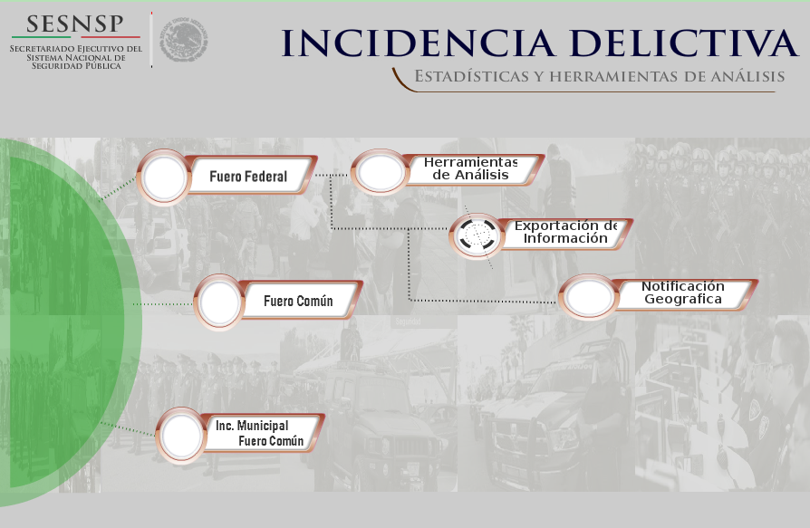
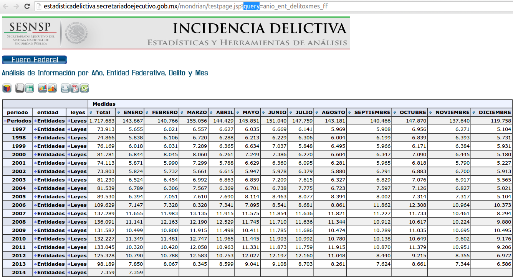
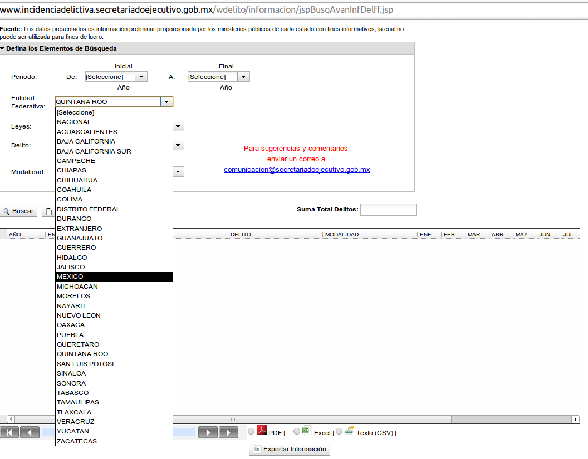

Differences in security between the last and the current governments in Mexico 
========================================================

Last Presidential term (2006-2012) in Mexico was characterized for the violence generated by the war against drug cartels. The current president belongs to a different party and he claimed that his security strategy would be more effective.

In this work, I will try to analize different security indicators for different Presidential terms: 2000-2006, 2006-2012 and 2012-present to see if there are clear differences in security betweeen goverments. 

The webpage [http://crimenmexico.diegovalle.net/en/](http://crimenmexico.diegovalle.net/en/) by [Diego Valle Jones](http://www.diegovalle.net), has some illustrative plots of a subset of crimes-related variables from the Mexican goverment website [Secretariado Ejecutivo del Sistema Nacional de Seguridad Pública](http://www.secretariadoejecutivo.gob.mx/es/SecretariadoEjecutivo/Incidencia_Delictiva). Each Mexican state sends its data in a monthly basis. I will be using the same sourse of data.

In the first section, I decribe what the data consists of. Then I describe some of the problems for downloading the data. The third section shows what I have done so far and the last section describes my plan for the rest of the project.

Description of the data
----------------------------------------------

According to the Federal Attorney General of Mexico, the data is categorized in two types:
- Federal: Those crimes that affect the health, the economy or the security of the country.
  - Against public health: trading, posession, production suplying, traffic, transportation and others.
  - Federal Law of Firearms and Explosives
  - Others: Intelectual property, against natural environment, election related, etcetera.
- Common: Those crimes that affect people directly. 
  - Offenses against property.
  - Sexual crimes
  - Homicides.
  - Injuries.
  - Kidnapping.
  - Common robbery.
  - Cattle raiding.
  - Road robbery.
  - Robbery in banks
  - Others.

Data extraction and associated complications
-------------------------------------------------

The data extraction turned out to be more difficult than I thought. The website of [Secretariado Ejecutivo del Sistema Nacional de Seguridad Pública](http://www.secretariadoejecutivo.gob.mx/es/SecretariadoEjecutivo/Incidencia_Delictiva) displays the following menu (it is in Spanish, but most of the words are cognates):



If the first option is selected, _Herramientas de Análisis_  (Analysis tools), you can create plots for the features and also download the data you are plotting, however, it never works well. The next image is a screenshot the site.



If you select the option _Exportación de Información_ (Exporting information), you can download the features that you want directly in a `csv` file. My idea was to try to do this automatically from `R`, but it never worked for me, not even manually. The following image shows that menu:


Finally, you can also download the tables in `pdf` files. I found a package in R that could help to obtain the information from tables in `pdf`, however, not all the information is available in `pdf`.

I sent an email message to Diego Valle. He told me that he decided to create those plots precisely because the [goverment webpage](http://www.secretariadoejecutivo.gob.mx/es/SecretariadoEjecutivo/Incidencia_Delictiva) never works. He send me his code in `Python` and he highlighted that he is constantly checking for new information and he extracts very little pieces of information since the wepages crashes otherwise. 

I decided then to use the data directly from [Diego Valle's website](http://crimenmexico.diegovalle.net/en/csv/). If I have time, I will work downloading the data by myself once I finish the other thing I want to do.

The work so far
---------------------------------------------------

I will decribe piece by piece what I have done. I am going to select the crime 'homicides' to illustrate what can be done and what I plan to do. This variable supports what I said at the beginning of the document that violence increased unbelievably during last Presidential term, although we can also observe that 15 years ago the situation was even worse (but none of that was reported on the media).

Loading packages that will be used.
```{r}
suppressPackageStartupMessages(library("ggplot2"))
suppressPackageStartupMessages(library("plyr"))
suppressPackageStartupMessages(library("dplyr"))
suppressPackageStartupMessages(library("lubridate"))
```

Then we read the data and create a date-type variable.

```{r reading, cache = TRUE}
# ### Download directly. It takes a lot of time
# ### Do not run!
# federal.link <- "http://crimenmexico.diegovalle.net/en/csv/fuero-federal-estados.csv.gz"
# common.link <- "http://crimenmexico.diegovalle.net/en/csv/fuero-comun-estados.csv.gz"
# con <- gzcon(url(federal.link))
# txt <- readLines(con)
# dat <- read.csv(textConnection(txt))

### Reading data.
common <- read.csv(gzfile("./data/fuero-comun-estados.csv.gz")) %.% tbl_df() #Common
federal <- read.csv(gzfile("./data/fuero-federal-estados.csv.gz")) %.% tbl_df() #Federal

common <- filter(common, crime != "OTROS DELITOS") %.% # Filter "other crimes"
  mutate(date = ymd(paste(year, month, "01", sep = "-"))) %.% # Adding date
  group_by(year, month, crime, date)
federal <- federal %.% 
  mutate(date = ymd(paste(year, month, "01", sep = "-"))) %.% # Adding date
  group_by(year, month, crime, date)

```

Each presidential term lasts six years. We have to associate with each date the days that the corresponding president has ruled the country and the political party. 

On the other hand, we also have to correct the state codes, since there are states with the worng labels. Since the Spanish diccionary does not longer consider the _ch_ combination as a letter, so the alphabetical order of the states is slightly different.

```{r fixing, dependson= "reading", cache = TRUE}
### This is the first day of goverment period for recorded data, i.e.,
## We have data starting on 1997. That president started his period on 1994-12-01
day0 <- ymd("1994-12-01")

## Now we add days of goverment and period of goverment.
aux <- function(date)
{
  ## Aux function to determine the period.
  ## Receives date type argument
  val <- ifelse(date < day0 + years(6), 0,
                ifelse(date < day0 + years(2*6), 1,
                       ifelse(date < day0 + years(3*6), 2, 
                              3)
                )
  ) 
  return(val)
}

dat <- mutate(dat, period.code = aux(date),
              days = as.numeric(date - years(period.code*6) - day0),
              party = c("PAN", "PRI")[((period.code == 0) | (period.code == 3)) + 1]) %.%
  group_by(period.code, days, party)
rm(aux)

## We also have to add the right state code, it is wrong beacuse the 'ch'
## is no longer considered "letter" in the Spanish diccitionary
aux <- function(code) 
{
  code[(code == 5) | (code == 6)] <- -1*(code[(code == 5) | (code == 6)] + 2)
  code[(code == 7) | (code == 8)] <- code[(code == 7) | (code == 8)] - 2
  code[code < 0] <- -code[code < 0]
  
  return(code)
}
dat <- mutate(dat, state_code = aux(state_code))
rm(aux)

```

Finally, we create the tables by states and national summarising different crime types.

```{r tables, dependson= "fixing", cache= TRUE}

## Creating table by states and adding 
state.wise <- summarise(group_by(dat, state_code, population), 
                        total = sum(count, na.rm = T)) %.%
  mutate(total.rate = 10000*total/population)  

## Same for the whole country
pop <- (dat %.% summarise(pop =  sum(unique(population))))$pop #  Population
national <- summarise(dat, total = sum(count, na.rm = T))
national$total.rate <- 10000*national$total/pop
```

The first plot shows the homicides rates (per 10000 person) by days of goverment. I will fix the labels, but 
- period.code = 0 is the period from 1994 to 2000,
- period.code = 1 is the period from 2000 to 2006,
- period.code = 2 is the period from 2006 to 2012 and
- period.code = 3 is the period from 2012 to now.

```{r, dependson= "tables", cache=TRUE, fig.height= 6, fig.width= 9}
### Homicides
qplot(days, total.rate, 
      data = filter(national, crime == "HOMICIDIOS"), 
      geom = "line", col = as.factor(period.code)) +
  ggtitle("Homicides rate by days of goverment")
```

Same crime, but now continuously.

```{r, dependson= "tables", cache=TRUE, fig.height= 6, fig.width= 9}
### Homicides
qplot(date, total.rate, 
      data = filter(national, crime == "HOMICIDIOS"), 
      geom = "line", col = as.factor(period.code)) +
  ggtitle("Homicides rate by date")
```

The following is the code used to extract the polygons, then I saved the data frame. Do NOT run.

```{r, eval= FALSE}
##### Extracting polygons and saving data.frame, so it will not be run again.
library("maptools")
xx <- readShapeSpatial("../mexico/MEX_adm1.shp")
xxx <- thinnedSpatialPoly(as(xx, "SpatialPolygons"), tolerance = 0.05, minarea = 0.0005, 
                          topologyPreserve = TRUE)
extractPolygons <- function(shapes) {
  require(plyr)
  
  dframe <- ldply(1:length(shapes@polygons), function(i) {
    ob <- shapes@polygons[[i]]@Polygons
    dframe <- ldply(1:length(ob), function(j) {
      x <- ob[[j]]
      co <- x@coords
      data.frame(co, order = 1:nrow(co), group = j)
    })
    dframe$region <- i
    dframe
  })
  # construct a group variable from both group and polygon:
  dframe$group <- interaction(dframe$region, dframe$group)
  
  dframe
}
mex <- extractPolygons(xxx)
write.csv(mex, "../mexico/polygons.csv")
```

Now we display two maps to make a comparison between two periods of time for the same crime.

```{r maps, dependson= "tables", cache = TRUE, fig.height= 7, fig.width= 13}
mex <- read.csv("./mexico/polygons.csv")[, -1]

## Associating value with response
value <- (filter(state.wise, month == 1, 
       year == 2009, crime == "HOMICIDIOS") %.% 
         arrange(state_code))$total.rate

homicides.2009.1 <- mutate(mex, value = value[region])

value <- (filter(state.wise, month == 1, 
                 year == 2014, crime == "HOMICIDIOS") %.% 
            arrange(state_code))$total.rate
homicides.2014.1 <- mutate(mex, value = value[region])

homicides <- rbind(cbind(homicides.2014.1, date = "Jan 2014"),
                   cbind(homicides.2009.1, date = "Jan 2009")) 

ggplot(data = homicides, aes(x, y)) +
    geom_polygon(col = "darkred", aes(order = order, group = group, 
       fill = value)) +
    facet_wrap(~ date) +
  scale_fill_gradient(low='white', high='darkred')
```

I will try now to do it in `ggvis`.
```{r , dependson= "maps", fig.height= 7, fig.width= 13}
suppressPackageStartupMessages(library("ggvis"))

ggvis(homicides.2014.1, props(x= ~x, y= ~y)) +
    layer_path(data= by_group(group))
```


This is use code is used when I was exploring the website to download the data.
```{r code, eval = FALSE}
###
### Part of the trials for downloading the data
###
# 
# library(XML) ## Loading library to read websites.
# 
# ## Main Page
# url <- "http://www.secretariadoejecutivo.gob.mx/es/SecretariadoEjecutivo/Incidencia_Delictiva"
# ## Crimes page
# url <- "http://www.incidenciadelictiva.secretariadoejecutivo.gob.mx/wdelito/"
# 
# ## Selecting periods page: Fuero Federal
# 
# ## This does not contain the information.
# url <- "http://estadisticadelictiva.secretariadoejecutivo.gob.mx/mondrian/testpage.jsp"
# 
# ## Year, state and month
# url <- "http://estadisticadelictiva.secretariadoejecutivo.gob.mx/mondrian/testpage.jsp?query=anio_ent_mes_ff"
# 
# 
# ## All crime types
# url <- "http://estadisticadelictiva.secretariadoejecutivo.gob.mx/mondrian/"
# 
# ## Parsing the site
# doc <- htmlParse(url)
# 
# ## Obtaining root
# root <- xmlRoot(doc)
# 
# ## Some numbers to look at
# length(xmlChildren(root)) ## Two elements in the structure
# names(xmlChildren(root)) ## Names of the two elements
# length(xmlChildren(xmlChildren(root)[[2]]))
# 
# ## Selecting body children
# body <- xmlChildren(xmlChildren(root)[[2]])
# 
# names(body)
# 
# body
# 
# download.file("http://www.secretariadoejecutivo.gob.mx/work/models/SecretariadoEjecutivo/Resource/131/1/images/publicacionFebrero2014_032014.pdf", "mes.pdf")
# 
# getNodeSet(root, "//*")
```

Selecting crimes
------------------------------------
There are many categories and subcategories of crimes. For the purpose of this work, I am going to select those that I consider more related with violence or drugs.

In this part, I will also translate the crime names to English.
```{r selecting, dependson= "maps", eval = FALSE}
dat

unique(dat$crime)

```


Remaining work
-------------------------------------
1. For sake of illustration, I considered only number of homicides. A representative selection of crimes must be done.
2. Use `shiny` or `ggvis` to interactive plots in such way that the user can select the crime and the days of dates, respectively for the first and second plots of homicides.
3. Add the option of an smoothing method.
4. The last plots of homicides is the one that compares two different dates and the value is displayed as color intensity. I am going to make this interactive, so the user can select the month and year for each map and also select the crime.